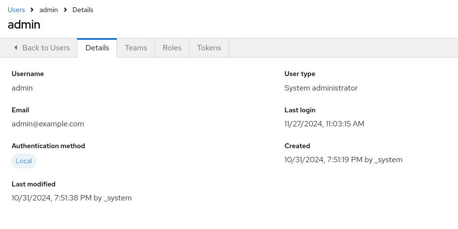
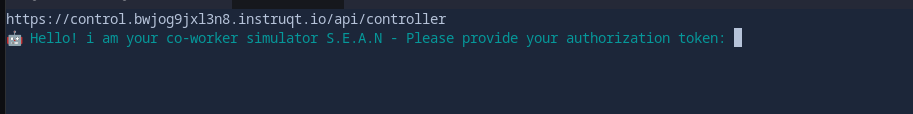
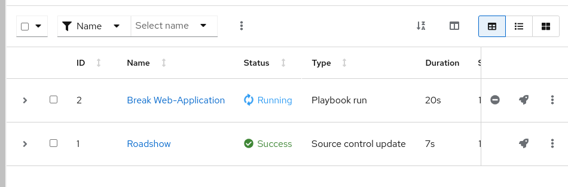
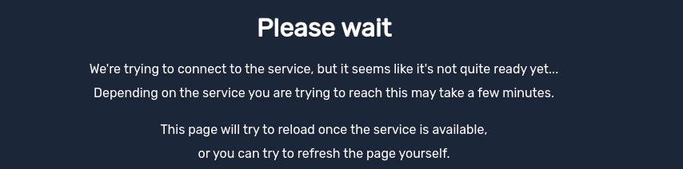
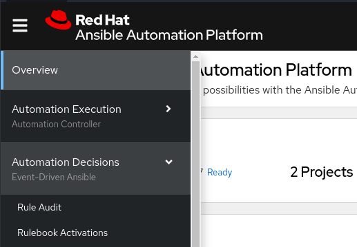
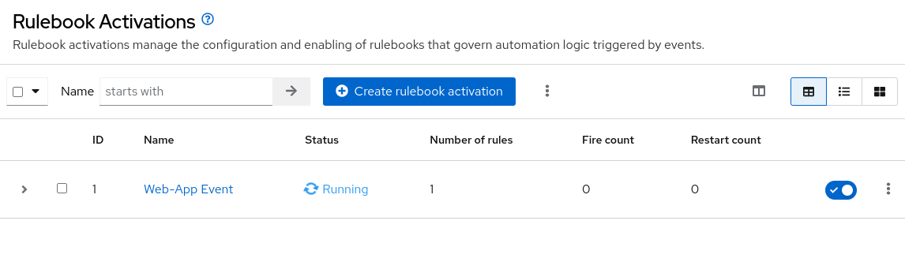

= Lab Guide: Operational Efficiency with Event-Driven Ansible
:toc:
:toc-title: Table of Contents
:sectnums:
:icons: font

_A guide to using the advanced features of Ansible Automation Platform, like Event-Driven Ansible, to reduce resolution time and prevent outages._

---

== Scenario: Operational Efficiency

Up until now, you have focused on technical automation. To unlock additional value, you can use Ansible Automation Platform to orchestrate between systems and act as the "glue" in your organization.

While your streaming platform is now easier to provision and configure, failures still happen. What if you could automate the response to those failures?

.Credentials
[cols="1,1", options="header"]
|===
| Ansible Automation Platform | ServiceNow
| `admin` / `ansible123!` | `aap-roadshow` / `Ans1ble123!`
|===

---

== Simulating an Application Failure

Last week, your streaming service was disrupted by an application failure that took hours to resolve. Let's see how Ansible Automation Platform could have helped.

. **Verify the web application is working.**
+
Navigate to the `Web-App` tab in your lab environment. You should see the application is online and working correctly.

. **Meet the "Co-Worker Simulator".**
+
To simulate the failure accurately, you will use a tool named S.E.A.N. This simulator uses the Ansible Automation Platform API to create issues on demand.
+
* **S**: System Saboteur
* **E**: Error Magnet
* **A**: Antisocial API
* **N**: Network Nullifier
+
image::.../assets/images/sean.png[S.E.A.N - The Co-Worker Simulator, opts="border"]

. **Create an API token in AAP.**
+
Navigate to your `aap` tab. From the main menu, go to **Access Management** → **Users**. Select the `admin` user and click on the **Tokens** tab.
+

+
Click the **Create token** button and configure it with the following details:
+
* **OAuth application:** (leave blank)
* **Description:** `API Access Token`
* **Scope:** `Write`
+
Click **Create token** and copy the generated token.

WARNING: You will only see this token once. Be sure to copy it, as you will need it to authenticate S.E.A.N.

. **Authenticate the S.E.A.N simulator.**
+
Navigate to the `S.E.A.N` tab. When prompted, paste the API token into the terminal. Once authenticated, a menu of options will appear.
+

. **Simulate the application failure.**
+
Select option **1** to run the `Break Web-Application` job. You can navigate to the `aap` tab and view the job running under **Automation Execution** → **Jobs**.
+

. **Verify the application is broken.**
+
Once the job completes, refresh the `Web-App` tab. You should now see an error message.
+

. **Restore the application.**
+
Return to the `S.E.A.N` tab and select option **2**. This will run the `Restore Web-Application` job. Verify in the `aap` Jobs view that it completes successfully, then refresh the `Web-App` tab to confirm the application is back online.

---

== Automating Remediation with Event-Driven Ansible

Simulating the failure was useful, but now let's prevent it from causing downtime in the future using Event-Driven Ansible.

. **Navigate to Rulebook Activations.**
+
In your `aap` tab, go to **Automation Decisions** → **Rulebook Activations**. This is where you can configure Event-Driven Ansible to listen for specific events and trigger automated responses.
+

. **Create a new rulebook activation.**
+
Click **Create rulebook activation** and configure it with the following details:
+
* **Name:** `Web-App Event`
* **Description:** `Rulebook to listen to configuration issues`
* **Project:** `Roadshow`
* **Rulebook:** `Webapp.yml`
* **Decision environment:** `Web Server`
* **Credential:** `AAP`
* **Restart Policy:** `On failure`
+
Click **Create rulebook activation**.

. **Wait for the rulebook to be active.**
+
On the Rulebook Activations page, wait for the status of your new activation to change to **Running**.
+

+
Your Ansible Automation Platform is now actively listening for events from the application server. The `Webapp.yml` rulebook is configured to watch for a failure of the `httpd` service.

. **Trigger the failure again.**
+
Navigate back to the `S.E.A.N` tab and select option **1** one more time to break the application.

. **Observe the automated remediation.**
+
Go directly to the `aap` tab and watch the **Automation Execution** → **Jobs** page. You will see the `Break Web-Application` job run as expected. However, a few seconds after it completes, the **`Restore Web-Application`** job will kick off by itself!
+
Event-Driven Ansible detected that the `httpd` service failed to restart during the "break" job and automatically triggered the "restore" job to remediate the issue, significantly reducing downtime without any human intervention.
