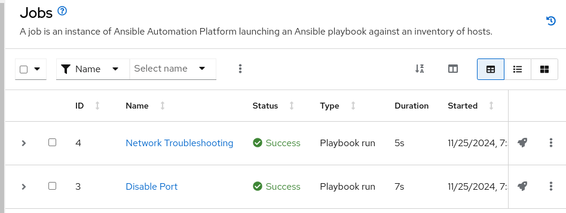
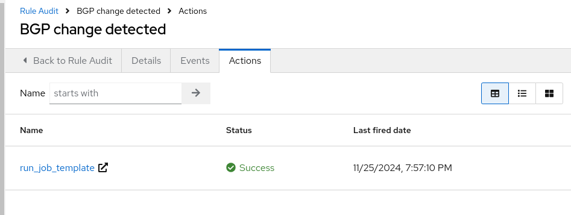
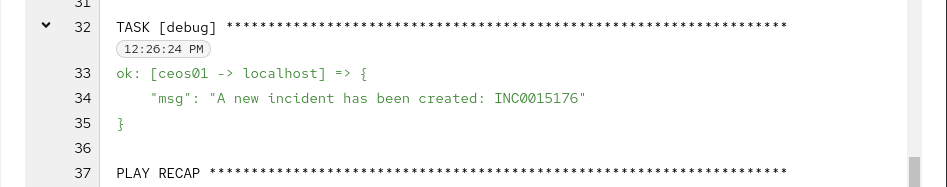
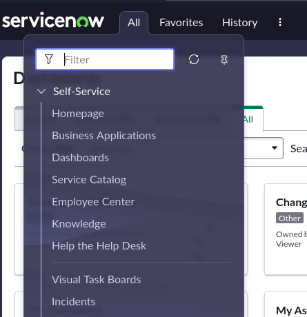
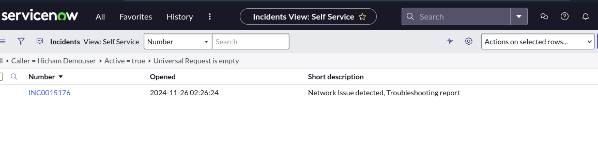
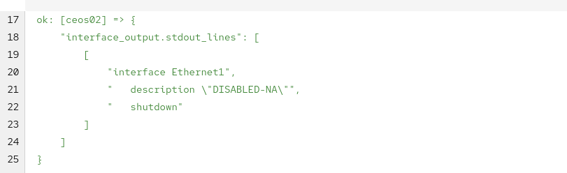
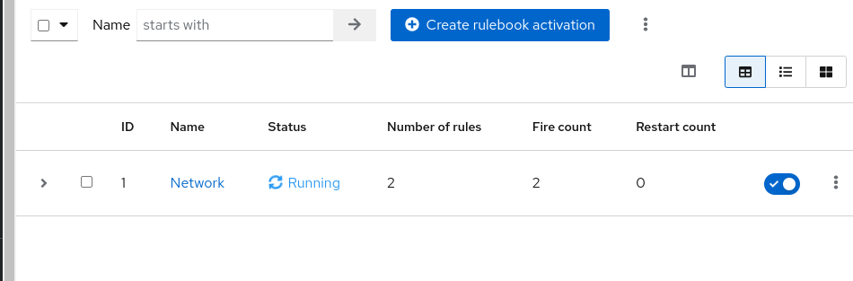
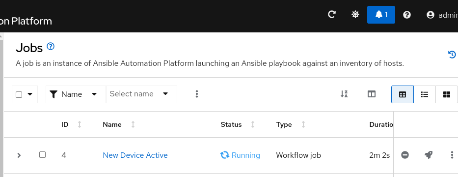
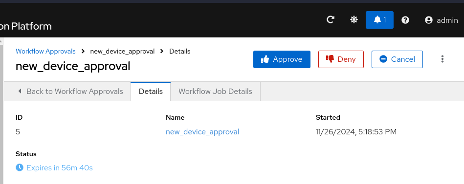
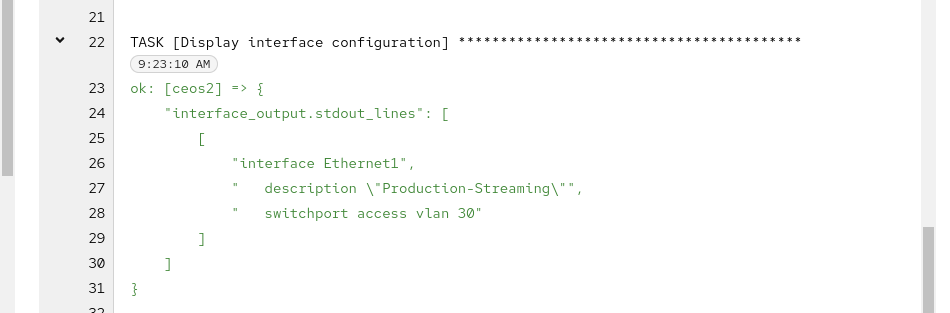

= Lab Guide: Proactive Network Operations with EDA
:toc:
:toc-title: Table of Contents
:sectnums:
:icons: font

_A guide to using Event-Driven Ansible to move beyond simple remediation and proactively gather information and automate mundane network tasks._

---

== Scenario: Proactive Network Operations

Delivering video across the globe is complex, and network problems can arise. While remediating issues automatically is powerful, it's not always the best first step for network problems. Instead, a consistent, automated troubleshooting process can gather crucial data for network engineers to resolve issues quickly.

---

== Information Gathering with Event-Driven Ansible

Your network engineers have created playbooks to assist with troubleshooting. You will now configure a rulebook to automatically run these playbooks when a network event occurs.

. **Create the "Network Event" Rulebook Activation.**
+
Navigate to your `aap` tab. Go to **Automation Decisions** → **Rulebook Activations**. Click **Create rulebook activation** and configure it with the following details:
+
* **Name:** `Network Event`
* **Description:** `Rulebook to listen to Network Telemetry`
* **Project:** `Roadshow`
* **Rulebook:** `network_stats.yml`
* **Decision environment:** `Network Telemetry`
* **Credential:** `AAP`
* **Restart Policy:** `On failure`
+
Click **Create rulebook activation**. Once running, this rulebook will listen for multiple network conditions.

. **Simulate a network failure.**
+
Navigate to the `S.E.A.N` tab. Select option **3** to have the simulator make a change to the network that affects the BGP configuration.

. **Observe the automated response.**
+
The Event-Driven Ansible controller will receive an event from the network telemetry. Navigate to the `aap` tab and go to **Automation Execution** → **Jobs**. You will see two jobs: one triggered by S.E.A.N's API call, and a second, **Network Troubleshooting**, which was triggered automatically by the event.
+

. **Examine the Rule Audit.**
+
In the `aap` tab, navigate to **Automation Decisions** → **Rule Audit**. You will see a "BGP change detected" event. Click on it to see the event payload and the action that was taken.
+

. **Review the troubleshooting output and ServiceNow ticket.**
+
Go to **Automation Execution** → **Jobs** and look at the output from the **Network Troubleshooting** job. The playbook backed up switch configurations, checked BGP status, verified reachability, and logged all this information in a ServiceNow ticket. Note the incident number from the job output.
+

+
To view the ticket, navigate to the `ServiceNow` tab and log in.
+
.ServiceNow Credentials
[cols="1,1", options="header"]
|===
| Username | Password
| `aap-roadshow` | `Ans1ble123!`
|===
+
Click on **All** → **Incidents**. Find your ticket in the list to see a full report ready for the networking team.
+

+

---

== Automating Mundane Tasks: Proactive Port Configuration

Event-Driven Ansible can also automate routine tasks, like configuring a network port when a new server is physically connected in a remote data center.

. **Define the Source of Truth.**
+
You can define a "source of truth" configuration that should be applied whenever a port becomes active.
+
[source,yaml]
----
my_sot:
  - name: Ethernet1
    mode: access
    access:
      vlan: 30
----

. **Check the current port configuration.**
+
In the `aap` tab, navigate to **Automation Execution** → **Templates** and launch the **Show port config** job template. This will show the current, unconfigured state of a port on the remote network switch.
+
NOTE: This template may be on the second page of the templates list.
+

. **Simulate plugging in a new server.**
+
Navigate to the `S.E.A.N` tab and select option **4**. This simulates an operator plugging a new server into a switch port.

. **Observe the event and pending approval.**
+
The running network rulebook will detect the "port up" event. In the `aap` tab, go to **Automation Decisions** → **Rulebook Activations** and notice the **Fire Count** has increased.
+

+
Now, go to **Automation Execution** → **Jobs**. A new workflow has been triggered, but it is paused with a **Pending** status, waiting for approval.
+

. **Approve the workflow.**
+
Click on the pending approval step in the job list.
+

+
Click the **Approve** button to allow the workflow to configure the port.

. **Verify the new port configuration.**
+
Once the workflow completes, click on the **New Port Configuration** job step. The output will show the new, compliant configuration that has been applied to the activated port. You've just configured a switch port without ever touching a command line!
+

---

== Appendix: Troubleshooting Code Snippets

If you're interested, here is the key code snippet from the network troubleshooting playbook.

[source,yaml]
----
tasks:
- name: Backup arista configuration
  arista.eos.eos_config:
    backup: true
    backup_options:
      dir_path: /tmp/
      filename: "{{ inventory_hostname }}.txt"
  register: config_output

- name: BGP Check
  arista.eos.eos_command:
    commands: show ip bgp summary vrf all
  register: bgp_summary

- name: Check reachability of switches
  arista.eos.eos_command:
    commands: "{{ switches }}"
  register: result

- name: Create incident
  servicenow.itsm.incident:
    instance:
      host: "{{ SN_HOST }}"
      username: "{{ SN_USERNAME }}"
      password: "{{ SN_PASSWORD }}"
    state: new
    caller: "{{ SN_USERNAME }}"
    short_description: "Network Issue detected, Troubleshooting report"
    description: |
      Network Issue:
      Backups Available on each switch @: "{{ config_output }}"
      {{ formatted_bgp_summary }}
      {{ formatted_switch_result }}
    impact: high
    urgency: high
  delegate_to: localhost
  register: new_incident
  run_once: true

- debug:
    msg: "A new incident has been created: {{ new_incident.record.number }}"
  delegate_to: localhost
  run_once: true
----
